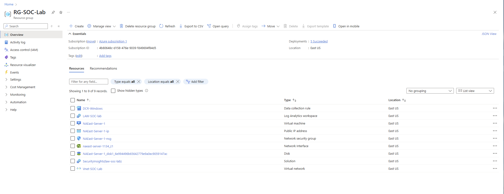
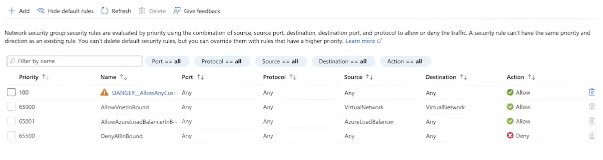
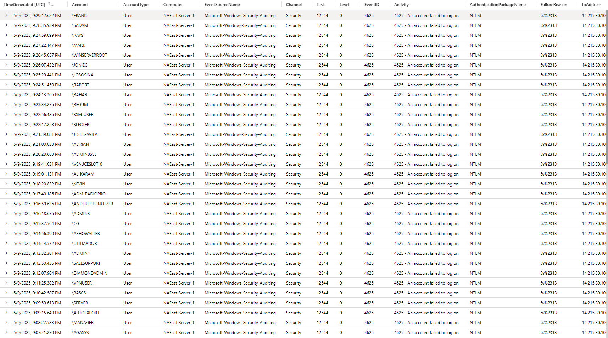
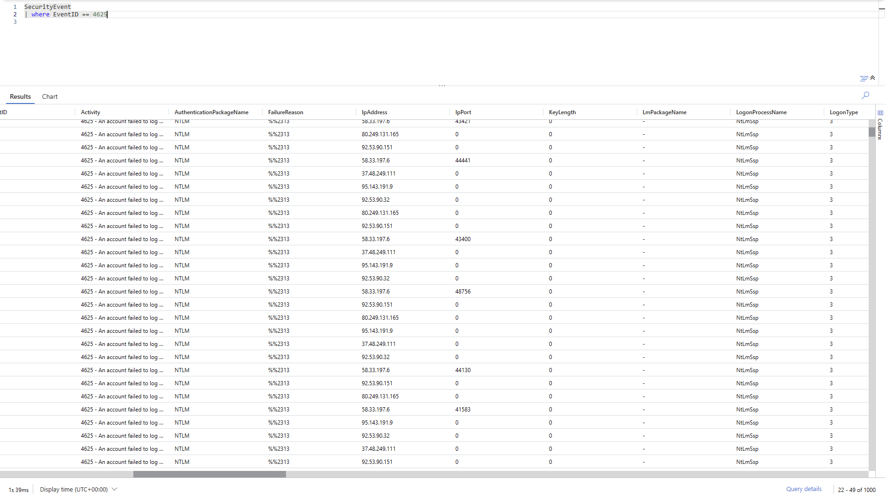
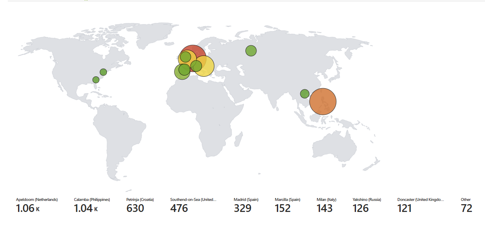

# SIEM-Honeypot

## Objective

This Honeypot SIEM project was designed to grow my understanding of attackers patterns and locations around the world. By simulating these attacks on a cloud virtual machine, I was able to analyze logs from real world scenarios in a controlled manner to better understand SIEM's (Microsoft Sentinel) and how to track real adversaries.

### Skills Learned

- Constructing a SIEM
- Interpreting network and windows event viewer logs
- Interpreting attack patterns and location of adversaries
- Broadened knowledge of protocols, ports, and security vulnerabilities
- Basic understanding of KQL

### Tools Used

- Microsoft Sentinel
- KQL
- Azure virtual machine

## Steps

I began this project by setting up a basic resource group in azure to host all the tools necessary to deploy this SIEM. Once the foundation was setup, I deployed a low resource virtual machine in the resource group and began running it after receiving a set IP address from the virtual network. This VM will act as the honeypot to attract attackers all around the world. 

(Finished azure foundation hosted in the resource group)

Now that the basics are setup, it is necessary to begin opening up defenses to allow attackers to start attempting to breach the defenses of this machine. To accomplish this, I set the security group connected to the virtual machine to allow all inbound connections on all ports. The next step is to log back onto the virtual machine and disable all firewalls locally. Both of these actions will make the machine extremely attractive to adversaries.

(Security group inbound all ports open)

Now that the virtual machine's defenses are down, I set up a log analytics workspace in microsoft sentinel. This will allow all event viewer logs to be displayed in the cloud. All adversaries actions will be trackable without touching the VM again. It will also improve queries through the use of KQL. The entire backend is now complete so the machine is able to be attacked and we can monitor attackers. It takes time for attackers to scan and attack the system, so the next step was roughly 4 hours later

(The logs generated by attackers)

These logs are all from attackers after the machine was published and running. You can see here it tracks things like username, IP addresses, events, and much more. Some key things to point out, the KQL filter only allows for event 4625 to show, which is a failed login attempt. This is a way to get only the relevant logs from the machine. There are also usernames such as System32 or WINSERVERROOT, which is a clever way for attackers to hide in the logs as these could be mistaken for legitamate system activity. Now that we have a clear understanding of the attackers, we can start logging the attacks on a map using GeoIP locations. Essentially, this is a way to run their IP addresses to figure out specifically what country they are from.

(Finished Product)

The map now has points and values associated with how many attempts the attackers made from each city/country. This is tracked through a Microsoft Sentinel Watchlist and workbook, and is completely live. If it were to be refreshed with current logs, it will continuously update.

This project was extremely fascinating to analyze where this machine was being attacked from. The sheer amount of pings it received in a short amount of time was extremely intriguing to me! This has the basic foundation of a SIEM, and would be very helpful to a company with many cloud VM's.
